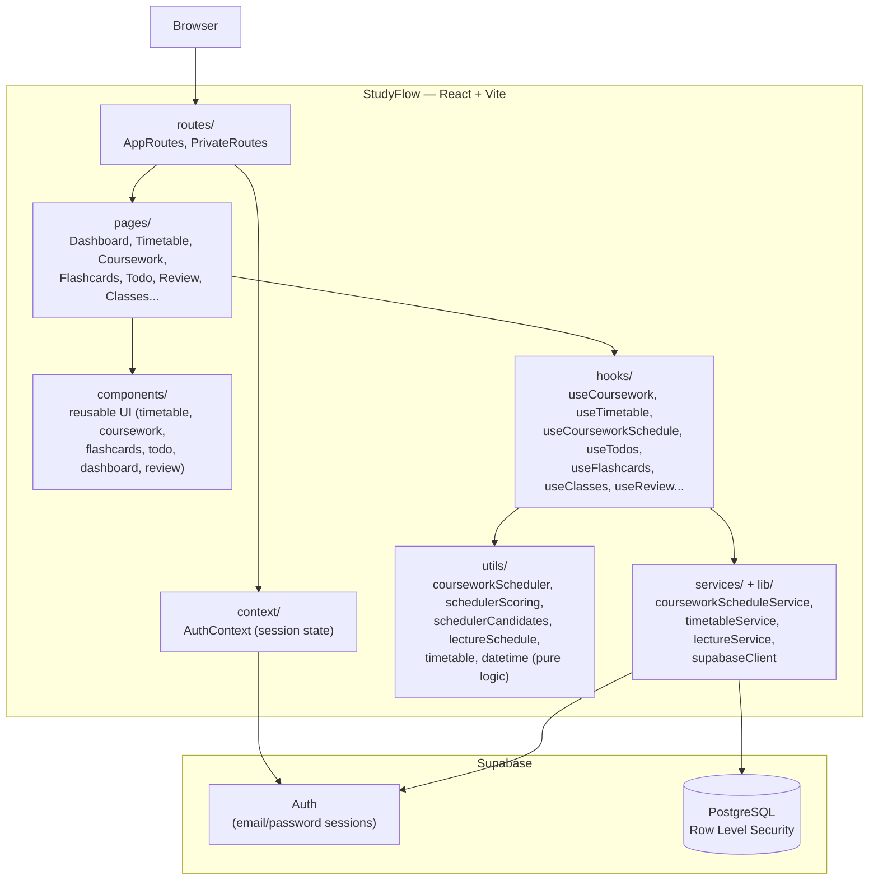
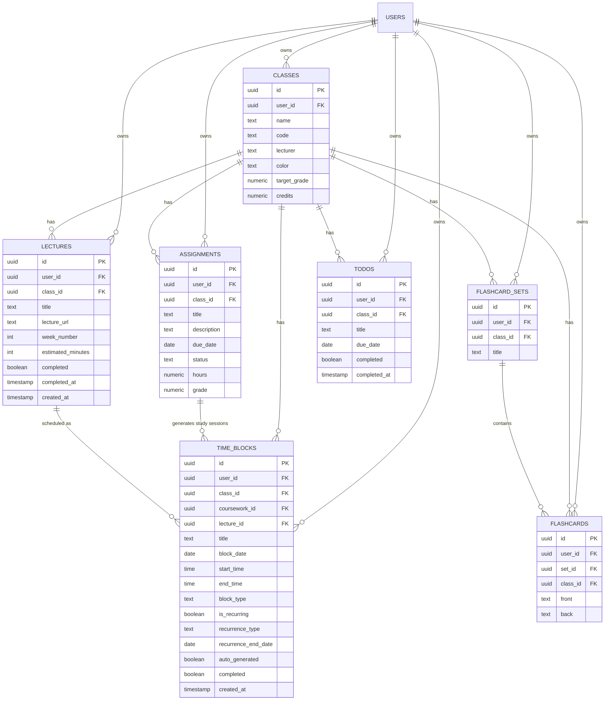
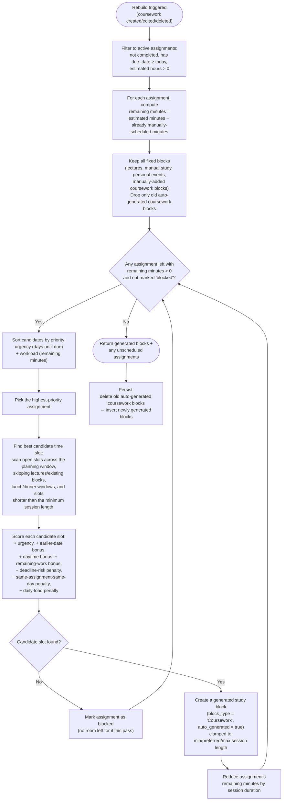
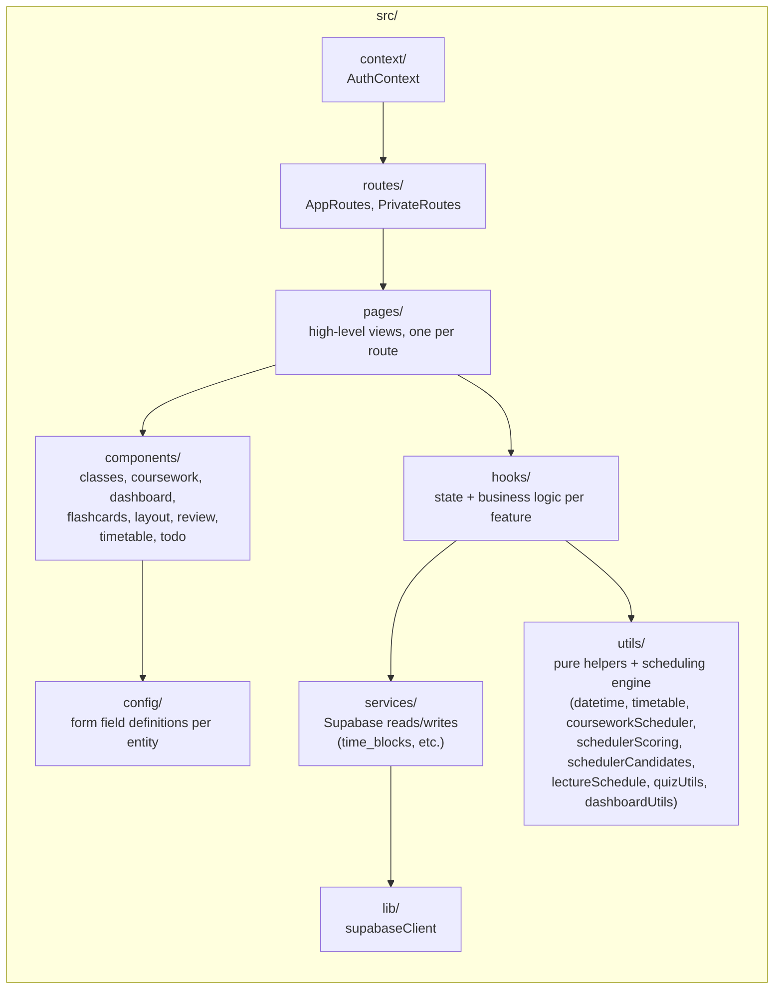

# StudyFlow

StudyFlow is a full-stack web application designed to help university students organise their academic workload. Instead of juggling multiple apps for timetables, coursework, flashcards and to-do lists, StudyFlow combines them into a single platform with an intelligent scheduling system that automatically plans study sessions around lectures and existing commitments.

---

## Features

### Timetable Management

* Weekly timetable view
* Recurring lecture scheduling
* Manual study blocks
* Automatic coursework sessions

### Coursework Management

* Create, edit and delete coursework
* Track deadlines
* Record grades
* Estimate study hours
* Monitor completion status

### Intelligent Study Scheduler

* Automatically schedules coursework before deadlines
* Avoids timetable conflicts
* Respects lectures and manually created events
* Distributes work across multiple days
* Prevents excessive daily workload
* Recalculates schedules whenever coursework changes

### Flashcards

* Organise cards into sets
* Quiz mode
* Review mode

### Todo Lists

* Personal task management
* Class-linked tasks
* Priority levels
* Completion tracking
* Overdue detection

### Class Management

* Store module information
* Lecturer details
* Credits
* Target grades
* Colour coding

### Dashboard

* Today's timetable
* Upcoming coursework
* Today's tasks
* Flashcard shortcuts
* Academic progress summary

### Review
* Check progress
* Current average grade
* Overdue task flags

---

# System Architecture



---

# Database Design



---

# Scheduling Algorithm

StudyFlow's core feature is its automatic coursework scheduler.

The scheduler works by:

1. Collecting incomplete coursework.
2. Ranking assignments by urgency and priority.
3. Finding available timetable slots.
4. Scoring candidate study sessions.
5. Selecting the highest-scoring time slot.
6. Repeating until all available study time has been allocated.

The scheduling engine is completely independent from the user interface, making it easy to maintain.



---

# Application Structure

```text
src/
├── components/
├── config/
├── hooks/
├── lib/
├── pages/
├── routes/
├── services/
└── utils/
```

The application follows a layered architecture:

* **Pages** – High-level views and routing.
* **Components** – Reusable UI elements.
* **Hooks** – Business logic and state management.
* **Services** – Communication with Supabase.
* **Utilities** – Pure helper functions and scheduling logic.



---

# Technology Stack

## Frontend

* React
* Vite
* Tailwind CSS
* React Router
* React Icons

## Backend

* Supabase
* PostgreSQL
* Row Level Security (RLS)

## Testing

* Vitest
* React Testing Library

---

# Testing

The project includes unit tests covering:

* Utility functions
* Custom hooks
* Service layer
* Timetable logic
* Scheduling helpers

Business logic has been separated from UI components wherever possible to maximise testability.

---

# Running Locally

## Clone the repository

```bash
git clone https://github.com/your-username/studyflow.git
cd studyflow
```

## Install dependencies

```bash
npm install
```

## Configure environment variables

Create a `.env` file.

```env
VITE_SUPABASE_URL=your_supabase_url
VITE_SUPABASE_ANON_KEY=your_supabase_anon_key
```

## Start the development server

```bash
npm run dev
```

## Run tests

```bash
npm test
```

## Build for production

```bash
npm run build
```

---

# Future Improvements

* Spaced repetition scheduling
* Calendar synchronisation
* Push notifications
* Mobile responsive improvements
* Analytics dashboard
* AI-assisted study recommendations

---

# Motivation

StudyFlow was built to solve a common problem faced by university students: academic information is often spread across multiple disconnected tools. By combining coursework management, scheduling, revision and planning into one application, StudyFlow reduces manual planning while helping students maintain consistent study habits.

The project demonstrates full-stack development using React and Supabase, modular application architecture, custom React hooks, automated scheduling algorithms, relational database design, and comprehensive testing.
